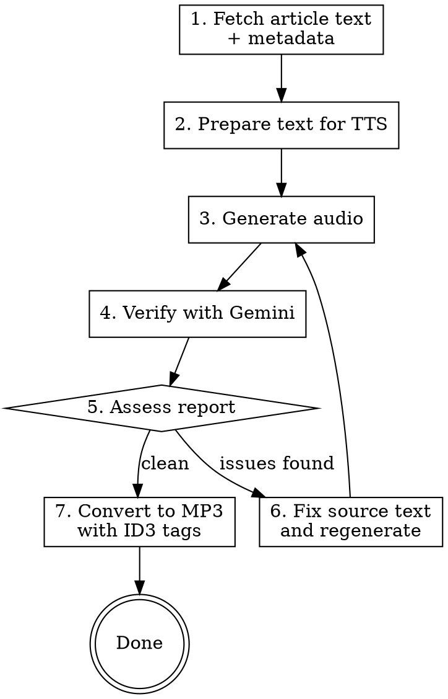

# Article TTS Recording

Iterative process for producing high-quality text-to-speech recordings of articles using the kokoro TTS toolkit (at `/Users/robergb/tools/kokoro`), with Gemini-based audio verification. Article content is fetched using the article-assistant tool (at `/Users/robergb/tools/article-assistant`).

## When to Use

- Converting a web article or long-form text to audio
- Quality matters — not just a quick-and-dirty generation
- Article has proper nouns, technical terms, or complex formatting

## Tools

This workflow uses two separate projects that interoperate via text:

| Tool | Location | Purpose |
|------|----------|---------|
| **article-assistant** | `/Users/robergb/tools/article-assistant` | Fetches article content and metadata from URLs |
| **kokoro TTS toolkit** | `/Users/robergb/tools/kokoro` | Generates audio, verifies quality, converts to MP3 |

Commands for article-assistant run from its directory. Commands for the TTS toolkit run from the kokoro directory.

## Workflow



## Step 1: Fetch Article Text and Metadata

Fetch content and metadata from the article-assistant project:

```bash
cd /Users/robergb/tools/article-assistant
uv run python article_assistant.py content "URL" --no-images
uv run python article_assistant.py metadata "URL"
```

The `content` command outputs clean Markdown to stdout. The `metadata` command outputs YAML to stdout in this format:

```yaml
---
title: Article Title
author:
  - Author Name
format: journal article
creation-date: YYYY-MM-DD
publication: The New Atlantis
periodical-edition: No. 83 (Winter 2026)
---
```

Save the metadata — you'll need title, author, publication, and edition for ID3 tags in Step 7.

## Step 2: Prepare Text for TTS

Save the article content as a `.md` file in the kokoro directory. Apply these transformations:

**Section breaks:** Replace visual separators (`#####`, `---`, `***`) with `[BREAK]` on its own line. This inserts a clean 2-second silent pause between sections. Do NOT use `...` on its own line — the TTS model vocalizes it as a garbled sound.

**Section headings:** Include them in the text. The markdown cleaner strips `#` prefixes but preserves the heading text, which will be read aloud.

**Paragraph length:** Break any paragraph longer than ~4-5 sentences into multiple paragraphs. Dense paragraphs with many quoted phrases are especially prone to TTS garbling.

**Quotes within quotes:** Simplify nested quotes (`"'economy.'"` → `"economy."`). Nested punctuation confuses the phonemizer.

**Roman numerals:** Spell out (e.g., "Pope Leo XIV" → "Pope Leo the Fourteenth", "World War I" → "World War One"). The TTS model reads characters literally.

**Em dashes:** Write as `--` in the source text. The `prepare_for_tts()` function automatically converts these to `...` for longer pauses.

**Links:** Strip regular URLs but keep the link text. The `--markdown` flag does this automatically. Phonetic pronunciation links (`[word](/phonemes/)`) are preserved by the markdown cleaner.

## Step 3: Generate Audio

```bash
cd /Users/robergb/tools/kokoro
uv run python text_to_speech.py article.md --voice af_heart --output recording.wav
```

The `--markdown` flag is auto-detected for `.md` files. It cleans emphasis, headers, code blocks, etc.

## Step 4: Verify with Gemini

```bash
uv run python verify_audio.py recording.wav article.md
```

This sends the audio and source text to Gemini 2.5 Flash, which listens to the recording and reports mispronunciations, missing/extra content, pacing issues, and audio quality problems — with approximate timestamps.

Cost: ~3 cents per verification of a 16-minute article.

## Step 5: Assess the Report and Fix

Use judgment when assessing Gemini's report. Not every flagged issue needs fixing:

- **Fix:** Garbled words, missing content, extra content, hallucinated sentences
- **Likely fix:** Mispronounced proper nouns, pacing issues in key passages
- **Likely ignore:** Minor pronunciation variants of common words (e.g., soft 't' in "Pontiac"), em dash pauses being slightly short (systemic), capitalization emphasis not conveyed (TTS can't do this), normal speech variation that Gemini is being overly granular about

Apply fixes to the source `.md` file according to the issue type:

### Common TTS Issues Reference

| Issue | Symptom | Fix |
|-------|---------|-----|
| **Garbled word** | Rare/foreign proper noun mangled | Phonetic override or word substitution |
| **Word doubled** | "computers, computers" | Change comma to em-dash before parenthetical |
| **Content echoed** | Title repeated before its quote | Restructure: replace colon with period before quote |
| **Content dropped** | Phrase missing from audio | Add paragraph break to shorten the sentence |
| **Hallucinated sentence** | Extra sentence not in source | Add `[BREAK]` or `...` pause before the quoted passage |
| **Whole paragraph garbled** | Long dense paragraph → gibberish | Break into 2-4 shorter paragraphs |
| **Words run together** | "contrascientism" | Add comma or em-dash between terms |
| **Pacing too fast** | Phrase rushed/slurred | Add paragraph break or `...` before it |

After fixing, regenerate (Step 3) and re-verify (Step 4). Expect 2-4 iterations for a long article; short articles may be clean on the first pass.

### Phonetic Overrides

Kokoro (via misaki) supports `[word](/phonemes/)` syntax for pronunciation overrides. The markdown cleaner preserves these while stripping regular links.

**Finding the right phonemes:** Use misaki's G2P on similar-sounding known words:

```python
from misaki import en
g2p = en.G2P()
print(g2p('jelly'))   # ʤˈɛli
print(g2p('penalty')) # pˈɛnᵊlti
# So "Pengelley" (pen-JEL-ee) → /pɛnʤˈɛli/
```

**When phonetic overrides don't work:** Some words resist overrides. Substitute a common synonym instead: "dewed" → "dew-covered". For proper nouns with no synonym, test the override in isolation before applying throughout.

### General Principles

- **Regenerate the full file** after fixes rather than trying to splice. Generation is fast (~3 min for 16 min of audio).
- **The TTS model is non-deterministic.** A new issue may appear that wasn't there before. If the source text looks correct, try regenerating once before restructuring.
- **Shorter sentences are always safer.** When in doubt, add a paragraph break.

## Step 7: Convert to MP3 with ID3 Tags

Once the recording is clean, convert to MP3 and tag it with the article metadata from Step 1:

```bash
uv run python convert_audio.py recording.wav "Article Title.mp3" \
    --title "Article Title" \
    --artist "Author Name" \
    --album "The New Atlantis, No. 83 (Winter 2026)"
```

Map the metadata fields from `article_assistant.py metadata` output:
- `title` → `--title`
- `author` → `--artist` (join multiple authors with "; ")
- `publication` + `periodical-edition` → `--album` (e.g., "The New Atlantis, No. 83 (Winter 2026)")

## Common Mistakes

- **Using `...` on its own line for section breaks.** This gets vocalized as garbled audio. Use `[BREAK]` instead.
- **Leaving very long paragraphs intact.** Paragraphs with 6+ sentences and many quoted phrases are the #1 cause of garbled audio.
- **Using phonetic overrides for every mispronunciation.** Word substitution is more reliable when a common synonym exists.
- **Not spelling out Roman numerals or abbreviations.** The TTS model reads characters literally.
- **Trying to fix every issue Gemini flags.** Use judgment — minor pronunciation variants and systemic em-dash pacing are not worth iterating on.
